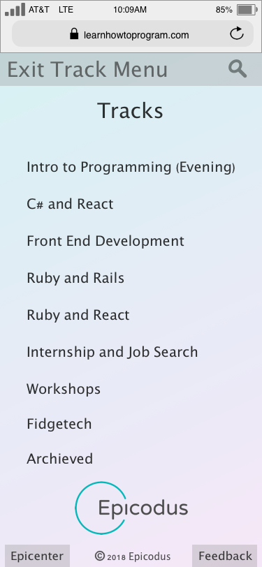

# Learn How To Program Redesign

#### A redesign of learnhowtoprogram.com, 11 Sept 2018

#### By Julianne Soifer, Eric Conner

## Description

A redesign of learnhowtoprogram.com with emphasis on user experience. Targeted users include: students, teachers/admin and employers seeking talent.

Here are some paper sketches from our initial planning phase:

Here are some wireframe images from our prototyping phase:

## Setup/Installation Requirements

* Download the files.
* Preview the prototype with Sketch.

## Known Bugs

No known bugs.

## Support and contact details

Questions? Feedback? Reach out to us!

juliannesoifer@gmail.com

theluvq@gmail.com

## Technologies Used

Developed with Atom, Sketch and Google Chrome on OS X.

### License

Copyright (c) 2018 **Julianne Soifer, Eric Conner**

This software is licensed under the MIT license.
